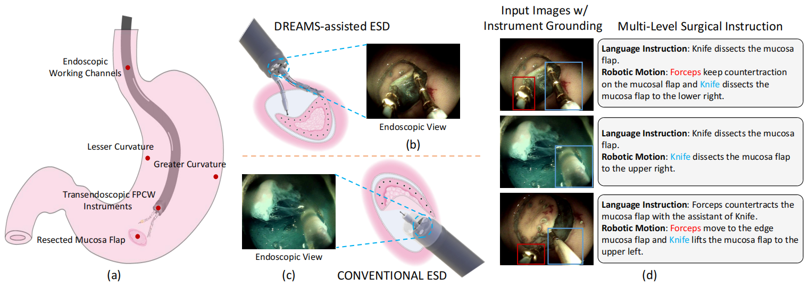

# CoPESD: A Multi-Level Surgical Motion Dataset for Training Large Vision-Language Models to Co-Pilot Endoscopic Submucosal Dissection

Guankun Wang∗, Han Xiao∗, Huxin Gao, Renrui Zhang, Long Bai, Xiaoxiao Yang, Zhen Li, Hongsheng Li†, Hongliang Ren†

## Overview

With the advances in surgical robotics, robot-assisted endoscopic submucosal dissection (ESD) enables rapid resection of large lesions, minimizing recurrence rates and improving long-term overall survival. Despite these advantages, ESD is technically challenging and carries high risks of complications, necessitating skilled surgeons and precise instruments. Recent advancements in Large Visual-Language Models (LVLMs) offer promising decision support and predictive planning capabilities for robotic systems, which can augment the accuracy of ESD and reduce procedural risks. However, existing datasets for multi-level fine-grained ESD surgical motion understanding are scarce and lack detailed annotations. In this paper, we design a hierarchical decomposition of ESD motion granularity and introduce a multi-level surgical motion dataset (CoPESD) for training LVLMs as the robotic Co-Pilot of Endoscopic Submucosal Dissection. CoPESD includes 17,679 images with 32,699 bounding boxes and 88,395 multi-level motions, from over 35 hours of ESD videos for both robot-assisted and conventional surgeries. CoPESD enables granular analysis of ESD motions, focusing on the complex task of submucosal dissection. Extensive experiments on the LVLMs demonstrate the effectiveness of CoPESD in training LVLMs to predict following surgical robotic motions. As the first multimodal ESD motion dataset, CoPESD supports advanced research in ESD instruction-following and surgical automation.

## Features

- CoPESD is built based on **a granular decomposition of surgical motions**, providing precise motion definitions for ESD.
- CoPESD is a fine-grained multi-level surgical motion dataset including **17,679 images with 32,699 bounding boxes and 88,395 multi-level motions**.
- We provide the link to download CoPESD.

<p align="center">
  
</p>

## Data Download

We offer the download link for all the data involved in CoPESD. We offer two categories of data for download and use. The first category is **free for download**. This sort of data has been involved in our previous work and can be downloaded and used by anyone. The second category of data is **request for download**, which needs to submit a request to us before downloading. For data security review purposes, we need to identify the applicant's usage of the data and determine whether to provide a download link based on that usage.

### Free Download Data

The free download data can be downloaded through [this link](https://drive.google.com/file/d/1JlbWeqhmbjcSNzPScTUrPa38zGk1oCgV/view?usp=sharing).

### Request Download Data

If you wish to have access to full CoPESD dataset, please kindly fill the request [form](https://docs.google.com/forms/d/e/1FAIpQLSeWSscEChOgqKlIzMwXbp1qlBSiy257lP-dveoyTF136fftMw/viewform).

## Fine-tuning on CoPESD dataset

###  Sphinx-ESD

#### Environment Setup

1. Follow the instructions provided in the [LLaMA2-Accessory](https://github.com/Alpha-VLLM/LLaMA2-Accessory) repository to set up the environment.

2. Download the pretrained Sphinx-Tiny-1k models from [huggingface](https://huggingface.co/Alpha-VLLM/LLaMA2-Accessory/tree/main/finetune/mm/SPHINX/SPHINX-Tiny-1k) and place them in the `sphinx_esd/accessory/data/SPHINX-Tiny` directory.

#### Fine-tuning with CoPESD Dataset

To fine-tune Sphinx-ESD-13B with different image sizes, use the following commands:

##### For Image Size 512:
   ```
   cd sphinx_esd/accessory
   bash exps/finetune_ens1_13b.sh
   ```
##### For Image Size 1024:
   ```
   cd sphinx_esd/accessory
   bash exps/finetune_ens5_13b.sh
   ```
#### Inference
To run inference and evaluate using the fine-tuned models, use the following command:
   ```
   cd sphinx_esd/accessory
   bash exps/generate_action.sh
   ```
###  LLaVA-ESD
#### Environment Setup

Follow the instructions provided in the [LLaVA](https://github.com/Alpha-VLLM/LLaMA2-Accessory) repository to set up the environment and download the pretrained LLaVA-1.5 models.

#### Fine-tuning with CoPESD Dataset

To fine-tune LLaVA-ESD-7B and LLaVA-ESD-13B models, use the following commands:

##### For the 7B model:
   ```
   cd llava_esd
   bash scripts/v1_5/finetune_copesd_7b.sh
   ```
##### For the 13B model:
   ```
   cd llava_esd
   bash scripts/v1_5/finetune_copesd_13b.sh
   ```
#### Inference
To run inference and evaluate using the fine-tuned models, use the following command:
##### For the 7B model:
   ```
   cd llava_esd
   bash scripts/v1_5/eval/eval_copesd_7b.sh
   ```
##### For the 13B model:
   ```
   cd llava_esd
   bash scripts/v1_5/eval/eval_copesd_13b.sh
   ```
### Checkpoints Release

We have released the fine-tuned model checkpoints on [huggingface](https://huggingface.co/HanXiao1999/CoPESD). You can download them and perform evaluations directly.
## Questions

If you have any questions, feel free to reach out to `gkwang@link.cuhk.edu.hk`. Please try to specify the problem with details so we can help you better and quicker!

## License

The new contributions of our dataset (e.g., the instructions, reference outputs, model ranking annotations, etc.) are licensed under the Creative Commons Attribution 4.0 International License (CC BY 4.0).
